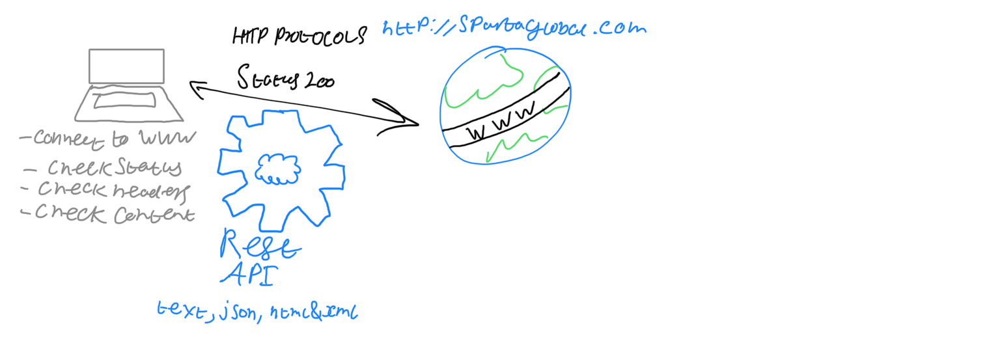
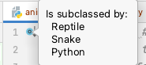

# Python OOP
## Functions
Let's create a function

Syntax: `def` is used to declare followed by name of the `function()`:
```python
def greeting():
    print("Welcome on board! Enjoy your trip!")

    
greeting() # If we didn't call the function it would execute the code but with no output
```
The key to functions is **DRY**:
- Don't
- Repeat
- Yourself

If you need to do the same thing in a program multiple times, just use functions and call it when you need them!

The `return` statement is used to signal the last thing a function will give to us before ending:
```python
def greeting():
    return "Welcome on board! Enjoy your trip!"


print(greeting())
```
So even though the output is the same as the first iteration above, the method of printing to the screen is different. `return` is very useful for passing data out of a function without printing it out to the screen. You can also discard stuff you don't need this way too

So let's start passing arguments (`args`) into the function so we can make it more personal to the user:
```python
def greeting(name):
    return "Welcome on board " + name


print(greeting("Lena")) # = "Welcome on board Lena"
```
We can even get creative and ask the user for their name:
```python
def greeting(name):
    return "Welcome on board " + name


print(greeting(input("Enter your name: ")))
```
Let's create a funtion with multiple args as an int:
```python
def add(num1, num2):
    return num1 + num2


print(add(9, 3)) # = 12
```
```python
def multiply(num1, num2):
    print("This function multiplpies 2 numbers") # This will get printed out
    return num1 * num2
    print(" this is required outcome of 2 numbers") # This comes after the `return` statement so will not execute


print(multiply(3, 3))
```
This means that all of the things you want done have to occur between `def` and `return`

## Modules, Packages AND Libraries
Python's extensive documentation on python.org

We have used functions that we created as well as the built in ones

`import` is the keyword that is used to import any module available in python.org

Let's see that in action:
```python
import math

num1 = 23.44 # Float
```
In a real life situation you have to round the figure depending on the value

If the value is less than .50 round it down to 23, if .51 then round it up
```python
print(math.ceil(num1)) # = 24
print(math.floor(num1)) # = 23
```
Let's `import random` now and see what we can do with that

Side note: in PyCharm, if something is greyed out, it is yet to be referenced. Like so:


That will be handy to let you know what you may have defined but not called.
```python
print(random.random())
```
Generates a random number between 0 and .99

How can we interact with our machine using python?
```python
import os # os used to get information about your OS
import datetime, sys # sys used to get system specific information

word_dir = os.getcwd() # provides the current location/path
print(word_dir)

# Linux/macOS
print(os.getuid) # = <built-in function getuid>
print(os.cpu_count()) # = 8
print(os.uname()) # = posix.uname_result(sysname='Darwin', nodename='MacBook-Pro.broadband', release='20.5.0', version='Darwin Kernel Version 20.5.0: Sat May  8 05:10:31 PDT 2021; root:xnu-7195.121.3~9/RELEASE_ARM64_T8101', machine='x86_64')
```
The problem with this is that you are going to have software that is run by people on ALL OS's, so building OS specific tools can be a bad idea
```python
print(datetime.datetime.today()) # Today's date = 2021-06-24 11:43:05.382436
print(sys.path) # = ['/Users/monotiller/Developer/Sparta Global/engineering89_python_oop', '/Users/monotiller/Developer/Sparta Global/engineering89_python_oop', '/Library/Frameworks/Python.framework/Versions/3.9/lib/python39.zip', '/Library/Frameworks/Python.framework/Versions/3.9/lib/python3.9', '/Library/Frameworks/Python.framework/Versions/3.9/lib/python3.9/lib-dynload', '/Users/monotiller/Developer/Sparta Global/engineering89_python_oop/venv/lib/python3.9/site-packages']
```

### PIP
```python
import requests
```
`requests` is a package to interact with a live API

We can make an API call to any web address using python requests packages

pip is a package manager in python to install any packages

```commandline
pip install requests
```

### APIs

```python
import requests

requests_api = requests.get("https://spartaglobal.com")

print(requests_api.status_code) # Prints the status code; 200 success, 404 not found etc. = 200
print(requests_api.headers) # Prints headers = {'Content-Type': 'text/html', 'Content-Encoding': 'gzip', 'Last-Modified': 'Mon, 21 Jun 2021 08:31:03 GMT', 'Accept-Ranges': 'bytes', 'ETag': '"e470c1c57766d71:0"', 'Vary': 'Accept-Encoding', 'Server': 'Microsoft-IIS/8.5', 'X-Powered-By': 'ASP.NET', 'Date': 'Thu, 24 Jun 2021 11:06:12 GMT', 'Content-Length': '12527'}
print(requests_api.content) # Prints out the HTML source

print(type(requests_api.status_code)) # Prints the type = <class 'int'>
print(type(requests_api.headers)) # = <class 'requests.structures.CaseInsensitiveDict'>
print(type(requests_api.content)) # = <class 'bytes'>
```


## The four pillars of OOP
In python, object oriented programming is based on the four pillars:
- Abstraction
    - Fill
    - these
- Inheritance
    - in
    - later
- Encapsulation
    - on
    - today
- Polymorphism
    - or
    - later


- Step 1 - Create an `animal.py` file to create parent class
- Step 2 - Create a file called `reptile.py` to abstract data and inherit from `animal.py`
- Step 3 - Create a file `snake.py`
- Step 4 - Create a file called `python.py` and at this point we should be able to utilise inheritence from the previous files and make everything available in `python.py`

Let's get in to it, starting with `animal.py`
```python
class Animal: # Follow the correct naming convention
    # We need to initialise with built in method called __init__(self)
    # self refers to current class
    def __init__(self):
        self.alive = True
        self.spine = True
        self.eyes = True
        self.lungs = True

    def breathe(self):
        return "Keep breathing to stay alive!"

    def eat(self):
        return "Time to eat"

    def move(self):
        return "Move left and right to stay awake"


# We need to create an object of this class in order to use any methods
cat = Animal() # Creating an object of Animal class
# For cat as a user the functionality inside Animal class and the method breathe is abstracted
print(cat.breathe())
```
To make life easier, PyCharm will tell you when you do, for example, `cat.`, to which file each function belongs to:


So on the left we have the function and on the right we have where it belongs to! That way it makes it easier to know if you are referencing the correct function

Cool, now let's create `reptile.py`
```python
from animal import Animal
```
If this was not in the same directory as your current file, you would have to give the absolute position
```python
class Reptile(Animal): # Inheriting from animal class
    def __init__(self): # note the (self), if this is missing it can cause errors, check for this in exam
        super().__init__() # super is used to inherit everything from the parent class, this may come up in the exam
        self.cold_blooded = True
        self.tetrapods = None
        self.heart_chambers = [3, 4]

    def seek_heat(self):
        return "It's chilly looking have fun in the sun"

    def hunt(self):
        return "Keep working hard to find food"

    def use_venom(self):
        return "If I have it I will use it"

# Let's create an object of Reptile class
smart_reptile = Reptile()
print(smart_reptile.breathe()) # breathe method is inherited from Animal class
print(smart_reptile.hunt()) # hunt() is available in Reptile class
print(smart_reptile.eat())
print(smart_reptile.move())
print(smart_reptile.hunt())
```
If we go back to `animal.py` for a second, we can see that PyCharm makes us aware that the `class` is being used in reptile:



And now on to `snake.py`
```python
from reptile import Reptile

class Snake(Reptile):
    def __init__(self):
        super().__init__()
        self.forked_tongue = True
        self.cold_blooded = True
```
Let's add some specific methods (methods means behaviours)
```python
    def use_tongue_to_smell(self):
        return "If I can touch it I can smell it"
```
Create an object of snake
```python
smart_snake = Snake()
print(smart_snake.move()) # move() is available from Animal class
print(smart_snake.hunt()) # hunt() is available from Reptile class
print(smart_snake.use_tongue_to_smell())
```
Now notice how we haven't called `Animal` at all, because it was inherited in `reptile.py` we automatically get access to it without having to manually import it

Hey, while we're at it, functions that start with but don't end with `__` will be hidden from the program. It is encapsulated. The data is hidden but can still be accessed, so you can hide data that is useful but you don't want to be generally available (passwords, encryption data, etc.)


Notice how `__shed_skin` is not in the autocomplete list!

Finally, let's go to `python.py`
```python
from snake import Snake

class Python(Snake):
    def __init__(self):
        super().__init__()
        self.large = True
        self.two_lungs = True

    def digest_large_prey(self):
        return "I can digest anything without chewing"

    def climb(self):
        return "Up we go!"

    def __shed_skin(self):
        return "Bye skin"

fast_python = Python()
print(fast_python.__)
print(fast_python.digest_large_prey())
print(fast_python.hunt())
print(fast_python.shed_skin())
```
